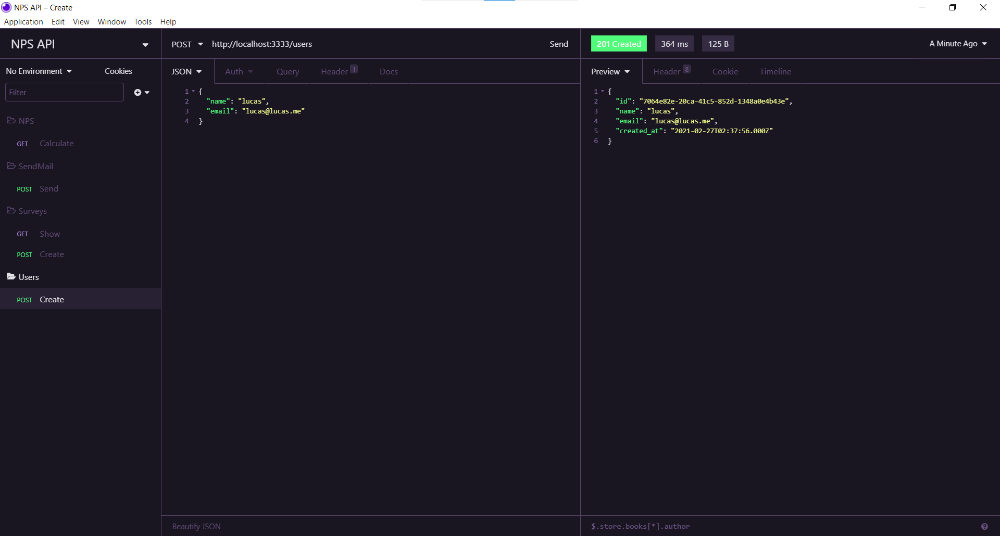

# NPS API

## Descrição

Um sistema para cálculo de NPS (Net Promoter Score), NPS API ajuda a medir a satisfação dos clientes.

## Tecnologias

As seguintes ferramentas foram usadas na construção do projeto:

- [TypeScript](https://www.typescriptlang.org/)
- [Node.js](https://nodejs.org/en/)
- [Express.js](https://expressjs.com/pt-br/)
- [Nodemailer](https://nodemailer.com/about/)
- [Jest](https://jestjs.io/)

## Rodando o Projeto

Para clonar e executar esta aplicação, você precisará de [Git](https://git-scm.com/) e [Node.js](https://nodejs.org/en/) instalados na sua máquina. Renomeie o arquivo .env.example para .env. Da sua linha de comando execute:

```bash
# Clone este repositório
$ git clone https://github.com/lucas-salles/nps-api.git

# Acesse a pasta do projeto
$ cd nps-api

# Instale as dependências
$ npm install

# Execute a aplicação em modo de desenvolvimento
$ npm run dev

# O servidor inciará na porta:3333 - acesse <http://localhost:3333>
```

Além disso, na raiz do projeto há um arquivo JSON do [Insomnia](https://insomnia.rest/download/) para chamar a API e testar as rotas.

### Tela do Insomnia



## Rodando os Testes

Para rodar os testes basta acessar a pasta do projeto. Da sua linha de comando execute:

```bash
# Acesse a pasta do projeto
$ cd nps-api

# Execute os testes
$ npm run test
```
